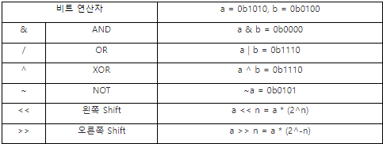
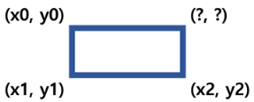

# 비트마스크(Bit Mask)

### 비트마스크란?
Bit를 하나의 Flag로 활용하여 자료 저장과 집합 표현을 쉽게 할 수 있는 알고리즘
<br>
<br>

### 비트 연산

<br>
#### 비트 연산 응용

1) & AND, | OR
  비트 집합 두 개를 AND하면 교집합, OR하면 합집합을 구할 수 있음 <br>

2) ^ XOR
  - true/false를 번갈아 바꾸는 스위치를 구현할 수 있습니다
  - bit를 바꿔서 대응되는 수를 구할 수 있음.
  - ex) ASCII 코드에 XOR을 적용해서 대소문자 변환<br>
    ``` java
    char case_convert(char alphabet) {
      return alphabet ^ 32;
    }
    // A  - 1000001
    // 32 - 0100000
    _______________
    // a  - 1100001 
    ```
    <br>
    
  - ex) 한 꼭지점의 좌표 구하기<br>
  이 직사각형의 세 꼭지점의 좌표가 주어졌을 때 남은 한 꼭지점의 좌표 구하기 <br>
  
  
  
	  ``` java 
	  (x0 ^ x1 ^ x2, y0 ^ y1 ^ y2)
	  
	  // x0, y0 - (0, 0)  x3, y3 - (?, ?)
	  // x1, y1 - (2, 0)  x2, y2 - (2, 2)
	  // (000000 ^ 000010 ^ 000010, 000000 ^ 000000 ^ 000010) => (000000, 000010) => (2, 2)
	  ```
<br>

3) ~ NOT
  - 비트 집합에 사용하면 가지고 있지 않은 원소들을 구할 수 있음
  - 음의 인덱스로 사용할 수 있음
  ex) 앞에서부터 i번째 원소와 뒤에서부터 i번째 원소를 출력하는 코드 <br>
	  ``` java
	    int arr[] = {0, 1, 2, 3, 4};
	    for (size_t i = 0; i < arr.length; ++i) {
	    	System.out.printf("%d %d\n", arr[i], arr[~i]);
	    }
	  ```
<br>
 
4) <<, >> shift

- 2의 거듭제곱 곱셈/나눗셈
- 정수 자료형을 왼쪽으로 i칸 밀거나 오른쪽으로 i칸 미는 연산은 각각 2^i를 곱하거나 2^i로 나누는 연산과 같음
- 특히 / 연산은 느리므로 나누는 수가 2의 거듭제곱일 경우 >>로 바꾸면 성능 향상을 얻을 수 있음
- %(나머지) 연산도 나누는 수가 2의 제곱수일 경우 &로 바꿀 수 있음

	ex) 곱하기, 나누기
	``` java
	// WARNING 음수일 때 제대로 동작하지 않음
	void div(int num, int x) {
		System.out.printf("%d / 2^%d = %d ... %d\n", num, x, num >> x, num & ((1 << x) - 1));
	}
	```

### 비트마스킹

1. 

