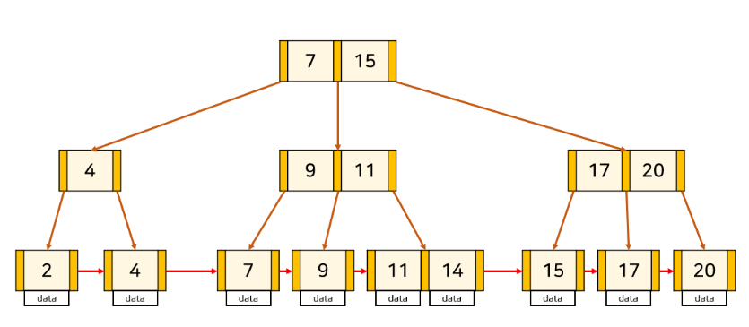

# Index

### 인덱스란?
데이터베이스 테이블에 대한 검색 성능의 속도를 높여주는 자료 구조

- 인덱스 생성 전략
  1. 조건절에 자주 등장하는 컬럼
  2. 항상 = 등호로 비교되는 컬럼
  3. 중복되는 데이터가 최소한인 컬럼 (가장 최선은 PK로 거는 것)
  4. ORDER BY 절에서 자주 사용되는 컬럼
  5. JOIN 조건으로 자주 사용되는 컬럼

### 구조
- B+Tree
  leaf node에만 데이터를 저장하고, 이외의 node에는 자식 포인터만 저장함
  
   
- HashTable
  O(1)의 시간복잡도를 가지지만, 잘 사용되지 않음

### 장점  
- 인덱스 테이블 스캔 시, 조건에 맞는 데이터를 빠르게 찾아낼 수 있음
- 부하가 많이 걸리는 작업인 Order by에 의한 정렬 과정을 피할 수 있음
- MIN 값과 MAX 값을 레코드의 시작 값과 끝 값 한 건씩만 가져오면 되기 때문에 효율적임

### 단점
정렬된 상태를 계속 유지시켜줘야 함
- DML(INSERT, UPDATE, DELETE)작업으로 인한 데이터 추가 및 변경 발생 시, 인덱스 테이블 내의 데이터들이 다시 정렬됨
- 테이블의 전체 데이터 중에서 10~15% 이하의 데이터를 처리하는 경우에만 효율적임
- 인덱스를 관리하기 위해서는 DB의 약 10%에 해당하는 저장공간이 추가로 필요함

