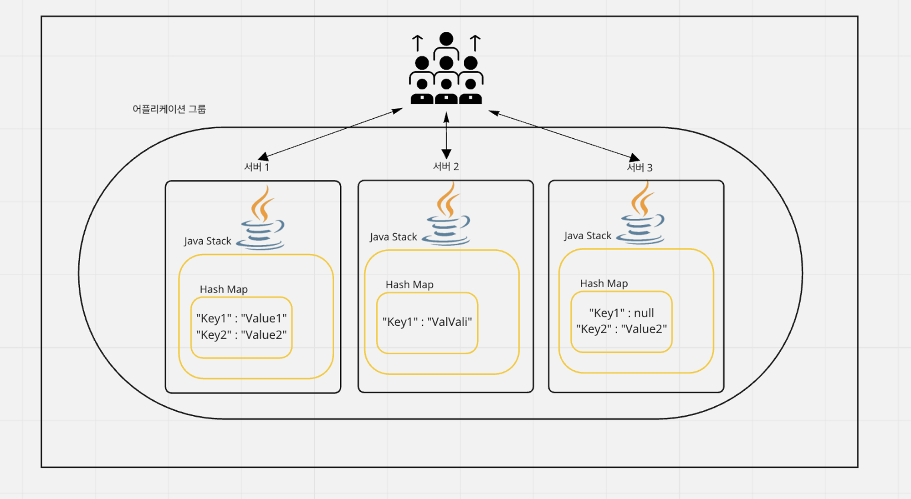
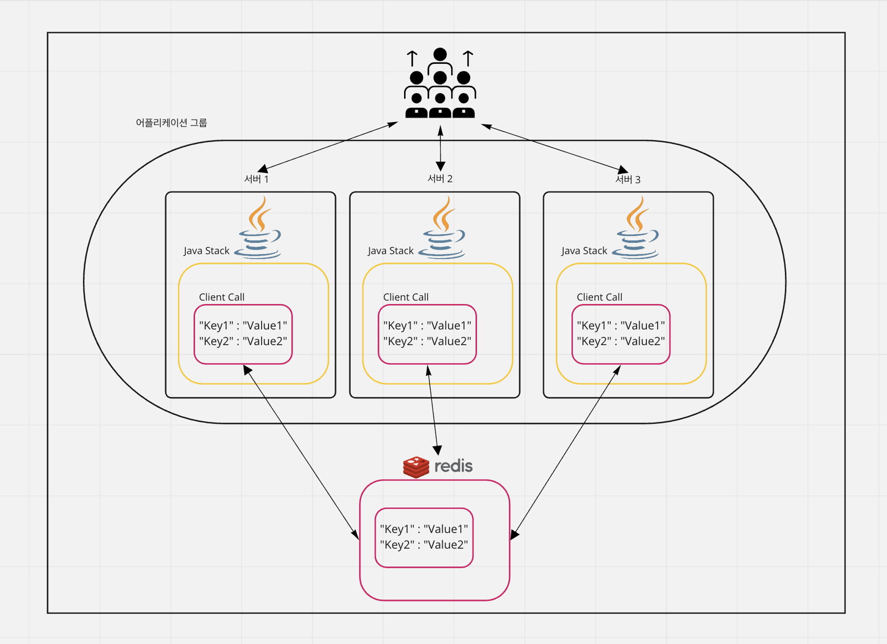

# Redis (Remote Dictionary Server)

## 요약

### 빠른 오픈 소스 인 메모리 키 값 데이터 구조 스토어( Key-Value Store)

- Key로 올 수 있는 자료형은 기본적으로 String이지만, Value는 다양한 타입을 지원
- 보통 데이터베이스는 하드 디스크나 SSD에 저장한다. 하지만 Redis는 메모리(RAM)에 저장해서 디스크 스캐닝이 필요없어 매우 빠른 장점이 존재한다.
- 캐싱도 가능해 실시간 채팅에 적합하며 세션 공유를 위해 세션 클러스터링에도 활용된다.

### RAM은 휘발성이라 껐다 킨경우 데이터가 사라지는데 데이터가 어떻게 남아있나??

 - snapshot : 특정 지점을 설정하고 디스크에 백업
 - AOF(Append Only File) : 명령(쿼리)들을 저장해두고, 서버가 셧다운되면 재실행해서 다시 만들어 놓는 것

### 자바 해쉬맵과의 비교
자바 HashMap도 똑같이 key-value 기반에 메모리 베이스인데 왜 Redis를 활용해야할까 궁금증이 들 수 있다.

그 이유는 <b>분산 환경에서의 장점</b>이 있기 때문이다.

예를 들어 유저 요청이 크게 늘어나 서버를 몇 대 증설하였는데 동일한 해쉬맵 데이터를 참조해야할 상황이 있다고 가정하면 원격 프로세스간에 동일한 해쉬맵 데이터를 참조해야 할 때, 분산환경에선 데이터를 동기화 하기 어렵다.
  

   

그래서 해결방법으로 별도의 레디스 서버를 구성해서 해당 레디스에서 값을 꺼내 쓴다면 메모리 기반 데이터 구조의 빠른 응답성을 확보함과 동시에 데이터 불일치 문제를 해결할 수 있다.
  
