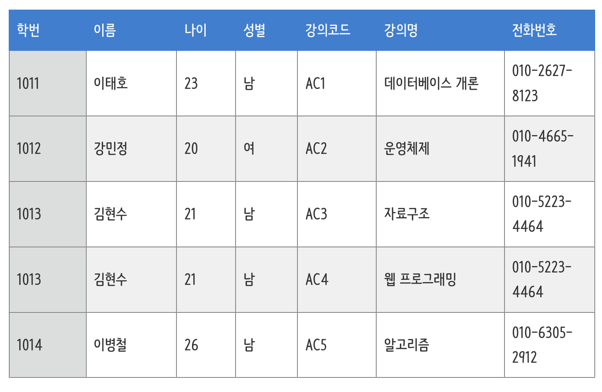

# 이상 현상

- 테이블을 잘못 설계하여 데이터를 삽입, 삭제, 수정할 때 생기는 논리적 오류

## 이상현상 종류

- 갱신 이상 : 중복된 데이터 중 일부만 수정되어 데이터 모순이 발생하는 경우
- 삽입 이상 : 데이터 삽입 시 의도하지 않은 데이터도 삽입해야 하는 상황
- 삭제 이상 : 어떤 정보 삭제 시 의도하지 않은 정보까지 삭제되는 경우

  

  - 강의를 아직 수강하지 않은 새로운 학생 삽입 시 강의코드, 강의 명 null 값 삽입 ( 삽입 이상 )
  - 강의코드 AC3를 가진 김현수 학생의 전화 번호 수정 시 같은 학생의 전화번호가 다르게 저장되는 문제 발생 ( 갱신 이상 )
  - 특정 강의 삭제 시 학생 정보도 삭제되는 문제 발생 ( 삭제 이상 )
