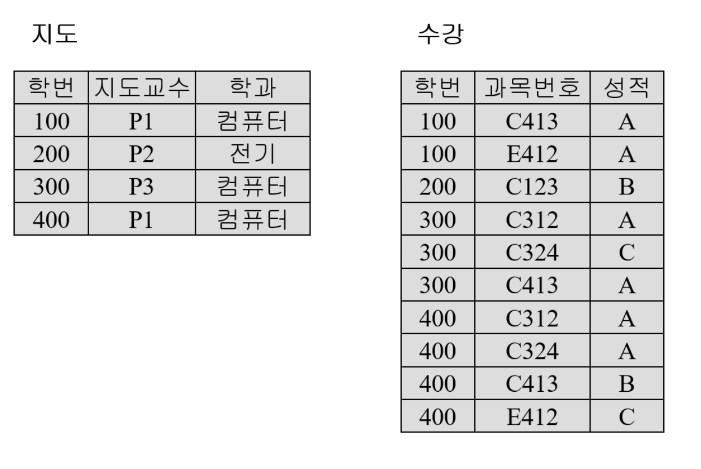

# 정규화 ( Normalization )

- 데이터의 중복을 줄이고 무결성을 향상 시키는 방법

## 정규화의 목적

- 데이터의 중복을 없애면서 불필요한 데이터를 최소화 한다.
- 데이터의 이상현상을 방지한다.
- 테이블 구성을 논리적이고 직관적으로 할 수 있다.
- 데이터베이스 구조 확장에 용이하다.

## 정규화의 종류

- 제1정규화, 제2정규화, 제3정규화, BCNF 정규화

### 제 1정규화

- 테이블 컬럼이 원자값 = 하나의 값을 가지도록 한다.

      - 제 1정규화가 필요한 DB

  

### 제 2정규화

- 제 1정규형을 만족해야 함
- 모든 컬럼이 부분적 종속이 없어야 함 = 완전 함수 종속
  - 완전 함수 종속 = 기본 키 중 특정 컬럼에만 종속되면 안됨! ( 모든 기본 키에 종속 될 것! )
  - 제 2정규화가 필요한 상황
    
- 기본키가 2개 이상의 컬럼으로 이뤄진 경우에만 진행
- 삽입 이상, 삭제 이상, 갱신 이상을 해결 할 수 없는 문제 발생 가능 ( 아래 사진 참고!)
  

### 제 3정규화

- 제 2정규형을 만족해야 함
- 기본키를 제외한 속성들 간의 이행 종속성이 없어야 함
  - 제 3정규화 필요 상황
    

### BCNF

- 제 3정규형을 만족해야 함.
- 모든 결정자가 후보키 집합에 속해야 함.
  - BCNF 필요 상황
    
  - ( 학생 번호, 과목)이 기본 키인 상황에서 과목 -> 지도교수의 종속이 성립하지 않음!

## 정규화의 장단점 ⚠️

### 장점

- 이상 현상 제거 가능
- 구조 변경에 용이

### 단점

- Join 연산이 많아짐 -> 반 정규화 고려 가능
- 질의에 대한 응답 시간이 느려질 수 있음

## QUIZ

- 다음과 같은 함수 종속성을 가지는 릴레이션은 어떤 정규형에 속하나요?
  
