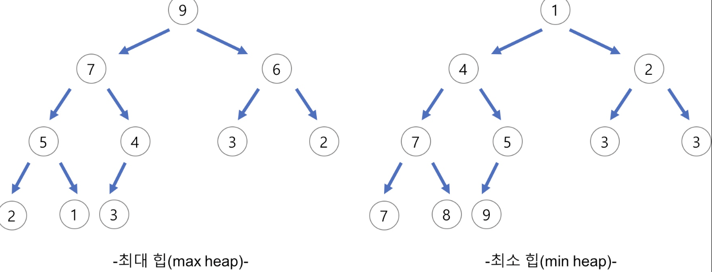

# HEAP ( 힙 )

- 우선순위의 큐를 만들기 위한 자료구조

### 우선순위 큐?!

- 데이터들이 우선순위를 가지고 있고 우선순위가 높은 데이터가 먼저 나오는 FIFO 선형 자료 구조
- 특징
  - 모든 요소는 우선순위를 가짐
  - 우선순위가 높은 요소가 낮은 요소보다 먼저 나오며 같을 시 큐의 순서에 따라 나옴
- 힙을 사용해 구현할 경우 O(logn)에 enQ / deQ 구현 가능 ( 배열의 경우 enQ-O(1) / deQ-O(N))

## HEAP

- 여러 값들 중 최대/ 최소를 빠르게 반환하기 위해 만들어짐.

### HEAP 특징

- 완전 이진트리 구조🔅
- 부모 노드의 키값과 자식 노드 키값 사이 대소 관계 성립 ( 형제 사이에는 정해지지 않음 )
- 힙 트리는 중복값 허용

### 최대 힙 ( MAX HEAP )/ 최소 힙 ( MIN HEAP )



- 최대 힙 : 가장 큰 값이 루트 노드에 위치
- 최소 힙 : 가장 작은 값이 루트 노드에 위치

### 면접 질문

- Tree와 Heap의 구조를 설명해주세요.
  - Tree는 스택, 큐와 같은 선형 구조가 아닌 비선형 자료구조로 계층적 관계를 표현하기에 적합
  - Heap은 완전 이진트리 형식으로 최댓값 또는 최솟값을 찾아내는 연산을 쉽게 하기 위해 고안된 구조

### 파이썬 heap

```
import heapq

heap = []
heapq.heappush(heap, 50)
heapq.heappop(heap)

heapq.heapify(heap)
```
