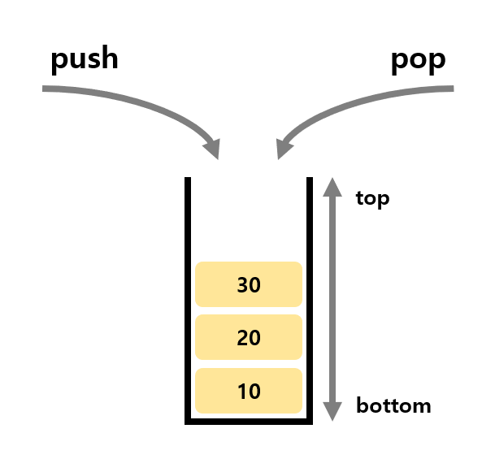
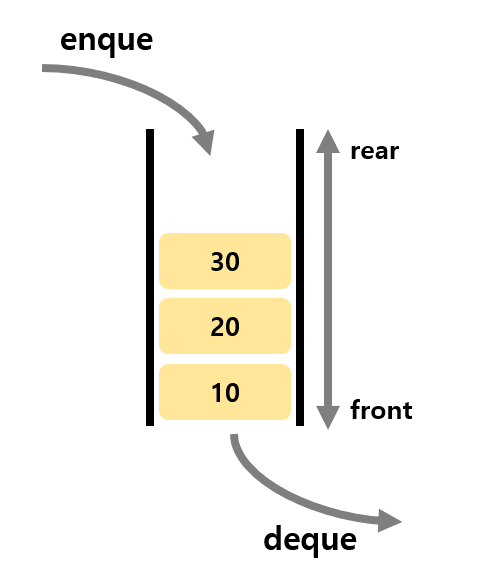

# Stack ( 스택 )

- 데이터를 일시적으로 저장하기 위한 자료구조

### 스택 데이터 추가, 삭제

- 데이터 추가 - push
  - 스택이 가득 차있는 경우 값을 추가하면 배열의 공간을 넘기 때문에 값을 넣을 수 없음
  - 전달받은 데이터를 넣을 수 있으면 스택의 마지막 값 뒤에 저장하고, 스택 포인터를 증가시킴
- 데이터 삭제 - pop
  - 스택이 비어 있을 경우 뺄 수 있는 값이 없기 때문에 동작이 수행될 수 없음
  - 스택이 비어 있지 않다면 스택의 꼭대기 값을 제거하고 그 값을 반환함

### 스택의 개념

- 스택이란 쌓아 올린다는 것을 의미
- 책을 쌓는 것처럼 차곡차곡 쌓아 올린 형태의 자료구조

### 스택의 활용 예시

스택의 특징인 후입선출(LIFO)을 활용하여 여러 분야에서 활용 가능

- 웹 브라우저 방문기록 (뒤로 가기) : 가장 나중에 열린 페이지부터 다시 보여줌
- 실행 취소 (undo) : 가장 나중에 실행된 것부터 실행을 취소함
- 역순 문자열 만들기 : 가장 나중에 입력된 문자부터 출력함
- 후위 표기법 계산
- 수식의 괄호 검사 (연산자 우선순위 표현을 위한 괄호 검사)

# Queue ( 큐 )

- 데이터를 일시적으로 쌓아 두기 위한 자료구조

### 큐의 개념

- 책을 쌓는 것처럼 차곡차곡 쌓아 올린 형태의 자료구조

### 큐 데이터 추가, 삭제

- 데이터 추가 - enque
  - rear(끝, 꼬리)의 데이터가 저장된 요소 다음에 데이터를 추가하는 메서드임
  - 큐가 가득차있는 경우 enque할 수 없음
  - 전달받은 데이터를 넣을 수 있으면 큐의 꼬리값 다음에 저장함
  - 메서드의 반환값은 enque한 값임
- 데이터 삭제 - deque
  - 큐가 비어 있는 경우 deque 할 수 없음
  - 큐가 비어 있지 않다면 front에 위치한 맨 앞의 요소를 꺼낸 다음 그 이후의 요소를 앞으로 옮기는 메서드임

### 큐의 사용 사례

큐는 주로 데이터가 입력된 시간 순서대로 처리해야 할 필요가 있는 상황에 이용

- 은행 업무
- 우선 순위가 같은 작업 예약 (프린터의 인쇄 대기열)
- 서비스 센터의 대기시간
- 프로세스 관리
- 너비 우선 탐색 (BFS, Breadth-First Search) 구현
- 캐시 (Cache) 구현
