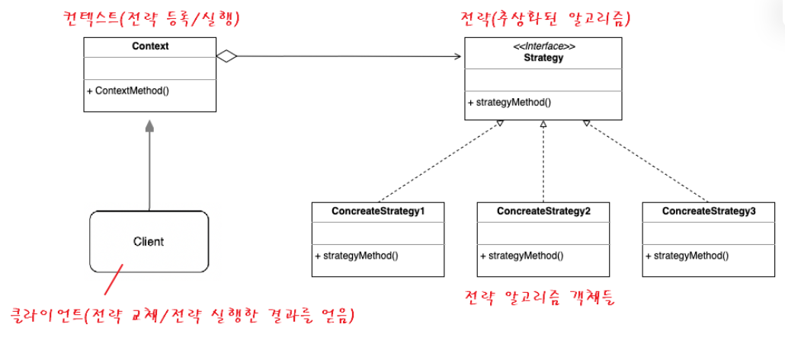
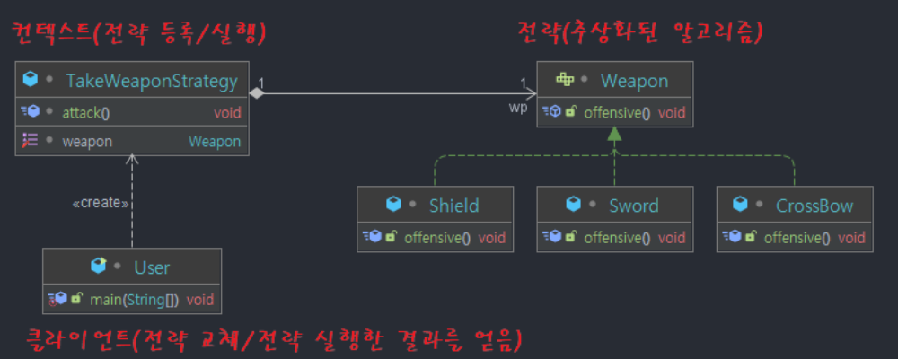

## 1. 정의

<aside>
💡 전략 패턴은 실행(런타임)중에 알고리즘 전략을 선택하여 객체 동작을 실시간으로 바뀌도록 할 수 있게 하는 행위 디자인 패턴이다.

</aside>

- 전략?
    - 일종의 알고리즘 혹은 기능, 동작이 될 수 있는 특정한 목표를 수행하기 위한 행동 계획
- 어떤 일을 수행하는 알고리즘이 여러가지 일 때, 동작들을 미리 전략으로 정의함으로써 손쉽게 전략을 교체할 수 있는, 알고리즈므 변형이 빈번하게 필요한 경우에 적합함

## 2. 패턴 구조



1. 전략 알고리즘 객체 : 알고리즘, 행위, 동작을 객체로 정의한 구현체
2. 전략 인터페이스 : 모든 전략 구현체에 대한 공용 인터페이스
3. 컨텍스트 : 알고리즘을 실행해야 할 때마다 해당 알고리즘과 연결된 전략 객체의 메소드를 호출
4. 클라이언트 : 특정 전략 객체를 컨텍스트에 전달함으로써 전략을 등록하거나 변경하여 전략 알고리즘을 실행한 결과를 사용

## 3. 전략 패턴은 OOP의 집합체이다.

1. 동일 계열의 알고리즘을 정의하고 → 전략 구현체의 정의
2. 각각의 알고리즘을 캡슐화하여 → 인터페이스로 추상화
3. 이들을 상호 교환이 가능하도록 만든다. → 합성으로 구성
4. 알고리즘을 사용하는 클라이언트와 상관없이 독립적으로 → 컨텍스트 객체 수정없이
5. 알고리즘을 다양하게 변경할 수 있게한다. → 메소드를 통해 전략 객체를 실시간으로 변경함으로써 전략을 변경

## 4. 전략 패턴 특징

### 1. 사용시기

- 전략 알고리즘의 여러 버전 또는 변형이 필요할 때 클래스화를 통해 관리
- 알고리즘 코드가 노출되어서는 안되는 데이터에 접근, 활용할 때 (캡슐화)
- 알고리즘의 동작이 런타임에 실시간으로 교체되어야 할 때

### 2. 주의점

- 알고리즘이 많아질수록 관리해야할 객체의 수가 늘어난다는 단점이 있다.
- 만일 어플리케이션 특성이 알고리즘이 많지 않고 자주 변경되지 않는다면, 새로운 클래스와 인터페이스를 만들어 프로그램을 복잡하게 만들 이유가 없다.
- 개발자는 적절한 전략을 선택하기 위해 전략 간의 차이점을 파악하고 있어야 한다.

## 5. 예제

### 클린하지 않는 코드

```java
class TakeWeapon {
    public static final int SWORD = 0;
    public static final int SHIELD = 1;
    public static final int CROSSBOW = 2;

    private int state;

    void setWeapon(int state) {
        this.state = state;
    }

    void attack() {
        if (state == SWORD) {
            System.out.println("칼을 휘두르다");
        } else if (state == SHIELD) {
            System.out.println("방패로 밀친다");
        } else if (state == CROSSBOW) {
            System.out.println("석궁을 발사하다");
        }
    }
}
```

```java
class User {
    public static void main(String[] args) {
        // 플레이어 손에 무기 착용 전략을 설정
        TakeWeapon hand = new TakeWeapon();

        // 플레이어가 검을 들도록 전략 설정
        hand.setWeapon(TakeWeapon.SWORD);
        hand.attack(); // "칼을 휘두르다"

        // 플레이어가 방패를 들도록 전략 설정
        hand.setWeapon(TakeWeapon.SHIELD);
        hand.attack(); // "방패로 밀친다"
    }
}
```

- 상태 변수를 통해 행위를 분기문으로 나누는 행위
    - if - else 지옥에 빠질 수 있다

### 전략 패턴을 적용한 코드



```java
// 전략 - 추상화된 알고리즘
interface Weapon {
    void offensive();
}

class Sword implements Weapon {
    @Override
    public void offensive() {
        System.out.println("칼을 휘두르다");
    }
}

class Shield implements Weapon {
    @Override
    public void offensive() {
        System.out.println("방패로 밀친다");
    }
}

class CrossBow implements Weapon {
    @Override
    public void offensive() {
        System.out.println("석궁을 발사하다");
    }
}
```

```java
// 컨텍스트 - 전략을 등록하고 실행
class TakeWeaponStrategy {
    Weapon wp;

    void setWeapon(Weapon wp) {
        this.wp = wp;
    }

    void attack() {
        wp.offensive();
    }
}
```

```java
// 클라이언트 - 전략 제공/설정
class User {
    public static void main(String[] args) {
        // 플레이어 손에 무기 착용 전략을 설정
        TakeWeaponStrategy hand = new TakeWeaponStrategy();

        // 플레이어가 검을 들도록 전략 설정
        hand.setWeapon(new Sword());
        hand.attack(); // "칼을 휘두르다"

        // 플레이어가 방패를 들도록 전략 변경
        hand.setWeapon(new Shield());
        hand.attack(); // "방패로 밀친다"

        // 플레이어가 석궁을 들도록 전략 변경
        hand.setWeapon(new Crossbow());
        hand.attack(); // "석궁을 발사하다"
    }
}
```

- 행위를 클래스화하여 캡슐화함
- 이전에는 상수값을 넘겨줬지만, 전략 패턴에서는 인스턴스를 넣어서 알고리즘을 수행하게 함
- 장점은 전략 무기를 추가로 등록할 때, 코드의 수정없이 빠르게 기능을 확장할 수 있음(클래스를 추가 후, implements)