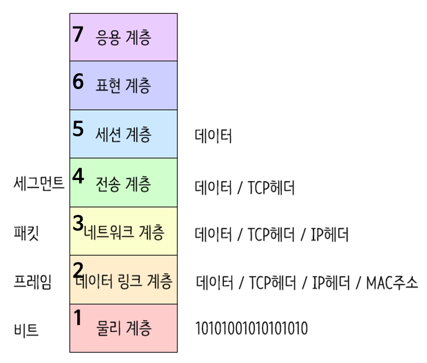
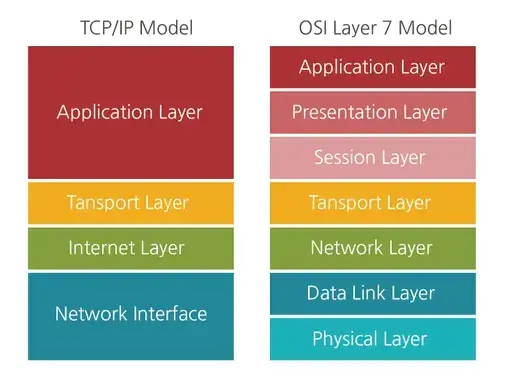

# OSI 7계층

- 네트워크 통신이 일어나는 과정을 7단계로 나눈 국제 표준화 기구(ISO)에서 정의한 네트워크 표준 모델
- 아래 그림과 같이 각 계층을 지날때마다 각 계층에서 Header가 붙게되고 수신측은 역순으로 헤더를 분석하게 된다.

7계층으로 나누는 이유? : 통신이 일어나는 과정을 단계별로 알 수 있고, 특정한 곳에 이상이 생기면 그 단계만 수정할 수 있다.

  

 

 ### 1계층 - 물리계층(PhysicalLayer)

 -  전기적, 기계적, 기능적인 특성을 이용해서 통신 케이블로 데이터를 전송하는 물리적인 장비
- 단지 데이터 전기적인 신호로 변환해서 주고받는 기능만 한다.
- 이 계층에서 사용되는 통신 단위는 Bit
- 장비 : 통신 케이블, 리피터, 허브

 

### 2계층 - 데이터 링크계층(DataLink Layer)

- 물리계층을 통해 송수신되는 정보의 오류와 흐름을 관리하여 안전한 통신의 흐름을 관리 
- 프레임에 Mac address를 부여하고 에러 검출, 재전송, 흐름제어를 수행한다.
- 이 계층에서 전송되는 단위 : 프레임
- 장비 : 브리지, 스위치, 이더넷

 

### 3계층 - 네트워크 계층(Network Layer)

- 데이터를 목적지까지 가장 안전하고 빠르게 전달
- 라우터(Router)를 통해 경로를 선택하고 주소를 정하고(IP) 경로(Route)에 따라 패킷을 전달 > IP 헤더 붙음
- 이 계층에서 전송되는 단위 : 패킷(Packet)
- 장비 : 라우터
 

### 4계층 - 전송 계층(Transport Layer)
- TCP와 UDP 프로토콜을 통해 통신을 활성화한다.
- 포트를 열어두고, 프로그램들이 전송을 할 수 있도록 제공해준다
    - TCP : 신뢰성, 연결지향적
    - UDP : 비신뢰성, 비연결성, 실시간
 

### 5계층 - 세션 계층(Session Layer)

- 데이터가 통신하기 위한 논리적 연결을 담당한다.
- TCP/IP 세션을 만들고 없애는 책임을 지니고 있다.
- API, Socket
 

### 6계층 - 표현 계층(Presentation Layer)

- 전송하는 데이터의 표현방식을 결정(ex. 데이터변환, 압축, 암호화 등)
- 파일인코딩, 명령어를 포장, 압축, 암호화
- JPEG, MPEG, GIF, ASCII 등
 

### 7계층 - 응용 계층(Application Layer)

- 최종 목적지로, 응용 프로세스와 직접 관계하여 일반적인 응용 서비스를 수행한다.
- 사용자 인터페이스, 전자우편, 데이터베이스 관리 등의 서비스를 제공한다.
- HTTP, FTP, DNS 등

# TCP/IP 4계층이란?

OSI 7계층보다 먼저 나왔지만 현재 더 많이 활용되는 그림이다.

### 1계층 - 네트워크 액세스 계층(Network Access Layer)
- OSI 7계층의 물리계층(1)과 데이터 링크 계층(2)에 해당

### 2계층 - 인터넷 계층(Internet Layer)
- OSI 7계층의 네트워크 계층(3)에 해당

### 3계층 - 전송 계층(Transport Layer)
- OSI 7계층의 전송 계층(4)에 해당

### 4계층 - 응용 계층(Application Layer)
- OSI 7계층의 세션 계층(5), 표현 계층(6), 응용 계층(7)에 해당한다.