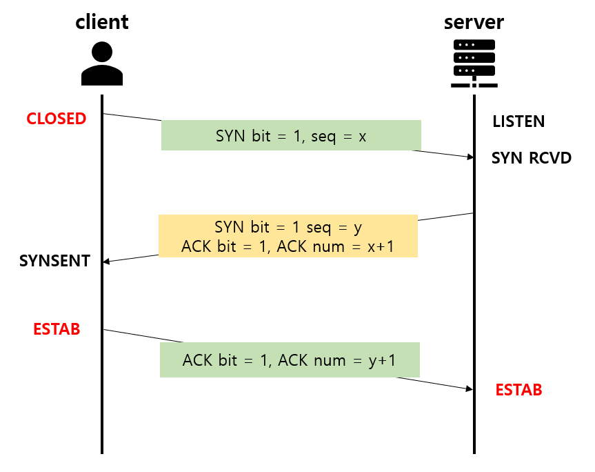
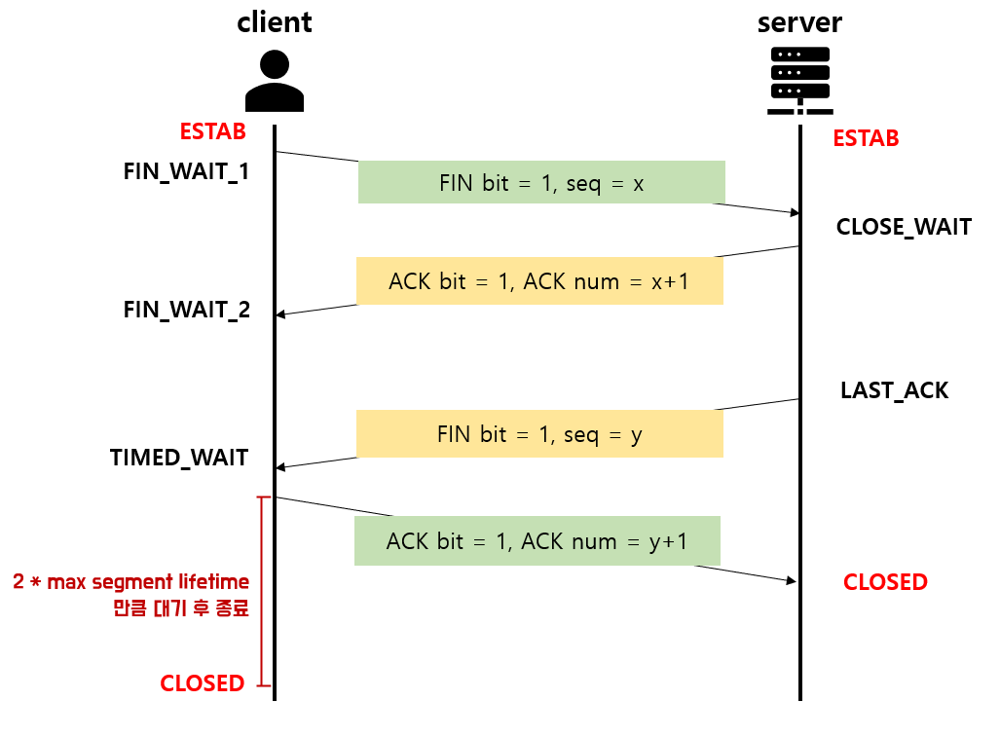

# TCP(Transmission Control Protocol)

### TCP 란?
- 인터넷상에서 데이터를 메시지 형태로 보내기 위해 IP와 함께 사용하는 프로토콜
- 신뢰적이고 연결지향성 서비스를 제공

### 3 way-handshake & 4 way-handshake
3 way-handshake 
: TCP 네트워크에서 통신하는 장치가 서로 연결이 잘 되었는지 확인하는 방법

1. Client 가 Server에 접속을 요청하는 SYN 플래그 전송
2. Server는 Listen 상태에서 SYN이 들어온 것을 확인하고, SYN + ACK를 Client 에게 전송
3. SYN + ACK 상태를 확인한 Client는 서버에게 ACK를 전송 후 연결이 성립됨

4 way-handshake 
: TCP 네트워크에서 통시하는 장치의 연결을 해제하는 방법

1. Client가 연결 종료 FIN 플래그를 Server에게 전송
2. FIN 플래그를 받은 Server는 확인 ACK를 Client에게 전송
3. Close 준비가 다 된 Server는 Client에게 FIN 플래그 전송
4. Client는 해지 준비가 되었다는 응답 ACK를 Server에 전송
   
### 흐름제어
- 송신측과 수신측의 데이터 처리 속도 차이를 해결하기 위한 기법
- 수신측이 송신측보다 데이터 처리 속도가 빠르면 문제 없지만, 송신측의 속도가 빠를 경우 문제 발생
- 수신측에서 제한된 저장 용량을 초과한 이우에 도착하는 데이터는 손실될 수 있음
- 기법
  1. Stop and Wait : 매번 전송한 패킷에 대해 확인 응답을 받아야만 그 다음 패킷을 전송하는 방법
  2. Sliding Window : 수신측에서 설정한 윈도우 크기만큼 송신측에서 확인 응답없이 세그먼트를 전송할 수 있게 하여 데이터 흐름을 동적으로 조절하는 제어기법

### 혼잡제어
- 송신측의 데이터 전달과 네트워크의 데이터 처리 속도 차이를 해결하기 위한 기법
- 데이터의 양이 수신 측에서 처리할 수 있는 양을 초과하게 되면 송신 측에서는 수신 측에서 처리하지 못한 데이터를 손실 데이터로 간주하고 계속 재전송을 하게됨. 이로인한 네트워크 혼잡도 증가
- 기법
  1. AIMD : 송신 측이 window size를 패킷 손실이 일어날 때까지 증가시키는 식의 접근법. 손실을 감지하면 송신측의 window size를 절반으로 줄임.
  2. Slow Start : 송신 측이 window size를 1부터 패킷 손실이 일어날 때까지 지수승으로 증가시킴. 패킷 손실을 감지할면 window size를 1 MSS로 줄임.
