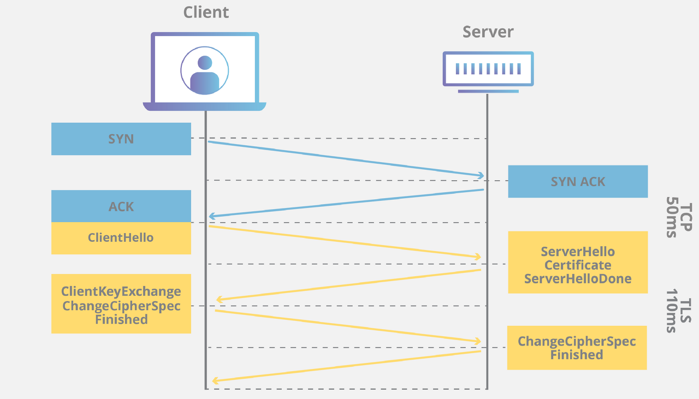

# What is TLS

## 1. 정의

TSL는 Transport Layer Security의 약자로 한국어로 하면 전송 계층 보안이며, 인터넷에서 이루어지는 통신이 진행될 때, 개인정보와 데이터 보안(전송되는 데이터 암호화)을 보다 용이하게 할 수
있도록 설계되어 널리 채택된 `보안 프로토콜` 이다. 웹 응용 프로그램(웹 사이트를 로드하는 웹 브라우저)과 서버 간의 통신을 암호화하는 것이다. 또한, 이메일, 메시지, 보이스오퍼 IP(VoIP) 등 다른 통신을
암호화하기 위해 사용된다.

모둗 핸드셰이크 프로세스를 용이하게 하고 브라우저와 웹 서버 간에 암호화된 통신을 설정하는 디지털 인증서를 사용한다.

TLS 프로토콜은 암호화, 인증, 무결성이라는 세 가지 주요 요소를 달성한다.

- 데이터를 암호화해야 하는 이유는 무엇일까?

  데이터를 암호화하지 않는 경우 다른사람이 신용카드 번호, 비밀번호와 같은 개인정보를 볼 수 있기 때문이다.

  TLS 인증서가 없으면 웹 사이트와 동일한 네트워크에 있는 모든 사람이 서버 - 웹 브라우저 간의 트래픽을 가로 챌 수 있다. 이렇게 가로챈 정보를 확인과 동시에 변조까지 할 수 있다.

- 핸드 세이크란?

  정상적인 통신이 시작되기 전에, 두 개의 실체 간에 확립된 통신 채널의 변수를 동적으로 설정하는 자동화된 협상 과정이다.

  즉, 연결이 잘 되어 있는지 확인하는 과정으로, 위의 정의에서 점점 개념을 확장해 나가면 된다.

<aside>
💡 TSL는 통신을 할 때 진행되는 보안 프로토콜이며, 웹 응용 프로그램 - 서버 간의 통신, 또는 다른 통신을 암호화하기 위한 것으로 요약할 수 있다.

**그럼, 이전에 배웠던 다른 보안 프로토콜(SSL, HTTPS)과는 어떤 차이가 있을까?**

</aside>

## 2. TLS & SSL의 차이점은 무엇인가?

짧게 요약하자면, TLS는 SSL(Secure Sockets Layers)이라고 불리는 암호화 프로토콜에서 발전한 형태이다. SSL은 컴퓨터 네트워크를 통해 통신 보안을 제공하며 데이터의 무결성과 기밀성을 보호한다.
하지만 TLS는 인터넷을 통핸 보안 통신을 위한 표준이다. 클라이언트, 서버 어플리케이션이 도청 및 정보 변조를 방지하도록 설계된 방식이다.

|        | SSL                                            | TLS                                        |
|--------|------------------------------------------------|--------------------------------------------|
| 의미     | 보안 소켓 계층                                       | 전송 계층 보안                                   |
| 버전     | SSL은 TLS로 대체                                   | TLS는 SSL의 업그레이드 된 버전                       |
| 알림 메세지 | 1. 두 가지 유형의 알림 메세지 존재   2. 알림 메세지는 암호화되지 않음 | 알림 메세지는 암호화되며 더 다양함                        |
| 메세지 인증 | MAC을 사용한다.                                     | HMAC을 사용한다.                                |
| 암호 그룹  | 보안 취약점이 있는 이전 알고리즘 지원                          | 고급 암호화 알고리즘 사용                             |
| 핸드 셰이크 | 1. 명시적 연결     2. 프로세스 단계가 복잡하고 느리다.         | 1. 암시적 연결         2. 단계가 적고 연결 속도가 빠르다. |

## 5. TLS의 작동 절차

먼저, 웹사이트 & 응용 프로그램이 TLS를 사용하려면 원본 서버에 TLS 인증서가 설치되어 있어야 한다. 인증 기관이 도메인을 소유한 사람 혹은 비즈니스에 TLS 인증서를 발행한다.

인증서에는 서버의 공개 키와 더불어 누가 도메인 소유자인지 정보를 포함하고 있다. 이 두 가지는 모두 서버의 신원을 확인하는데 중요하다.

인증서를 모두 발행했으면 다음과 같은 TLS Handshake의 일련의 순서를 통해 초기화된다.

1. TLS 연결은 TLS HandShake를 사용한다. 사용자가 TLS를 사용하는 웹사이트를 접속하면 클라이언트와 웹 서버간의 TLS HandShake가 시작된다.
2. 클라이언트는 서버의 인증서를 받아 서버의 무결성을 확인
3. 신뢰할 수 있는 서버라면, 암호화 통신에 사용할 대칭키를 서버의 공개키로 암호화하여 전달한다.

<aside>
💡 즉, 데이터를 주고 받기 전 서버의 무결성을 확인하고 대칭키를 전달하는 과정을 TLS HandShake라고 한다.

</aside>

## 6. TLS Handshake

TLS HandShake를 하는 동안 클라이언트와 웹 서버는 아래의 일을 수행한다.

1. 사용할 TLS 버전 지정
2. 사용할 암호 제품군 결정 - 공유된 암호키 & 세션 키와 같은 세부 정보를 명시하는 알고리즘 집합
3. 서버의 TLS 인증서를 사용하여 서버의 신원을 인증
4. HandShake가 완료된 후 메세지를 암호화하기 위한 세션키 생성

1. Client : Client Hello (암호화 알고리즘 나열 및 전달)

   클라이언트가 서버로 “Client Hello” 메세지를 전송하면서 핸드 셰이크를 개시한다. 이 메세지에는 클라이언트가 지원하는 `TLS 버전`, `지원되는 암호 알고리즘`,
   그리고 `클라이언트 무작위 데이터` (클라이언트에서 생성한 난수로 대칭키를 만들 떄 사용), `세션 ID`, `SNI(서버명)`이 포함된다.

    - Session ID란?

      매번 연결할 때마다 HandShake 과정을 진행하는 것을 비효율적이기 때문에 최초 HandShake 과정을 진행하고 Session ID를 가진다. 해당 ID로 위 과정을 반보해서 진행하지 않는다.

      

2. Server : Server Hello (암호화 알고리즘 선택)

   Client Hello 메세지에 대한 응답으로 서버가 `서버의 TLS(SSL) 인증서`, `암호화 방식(클라이언트가 보낸 암호화 방식 중에서 서버가 가능한 암호화 방식 선택),` Server Random
   Data(서버에서 생성한 난수, 대칭키를 만들 때 사용), SessionID(유효한 Session ID)를 전송한다.

3. Server : Server Certificate (인증서 전달)

   서버의 인증서를 클라이언트에게 보내는 단계, CA의 증명서도 함께 전송한다. (서버의 정보 + 서버의 공개키)

4. Client : Client Key Exchange (데이터를 암호화할 대칭키 전달)

   인증서의 무결성이 검증되었으면(3번 인증 과정), 클라이언트의 난수와 서버의 난수를 조합하여 대칭키를 생성한다. 그리고 대칭키를 서버의 공개키로 암호화한다. (공개키를 어떻게 가지고 있나? → 인증서를 인증할
   때, 복호화하면서 얻음)

5. Server & Client : Change Ciper Cpec

   이제부터 전송되는 모든 패킷은 협상된 알고리즘과 키를 이용하여 암호화하겠다고 알리는 메세지이다.

6. Server & Client : Finished(정보 전달 완료)
    1. 클라이언트가 세션 키로 암호화된 `finished` 완료 메세지를 전송한다.
    2. 서버가 세션 키로 암호화된 `finished` 완료 메세지를 전송한다.
7. 안전한 대칭 암호화 성공

   핸드 셰이크가 완료되고 세션 키를 이용해 통신이 계속 진행된다.

---

## TLS & HTTPS의 차이점은 무엇인가?

HTTPS는 HTTP 프로토콜 상위에서 TLS 암호화를 구현한 것으로 모든 웹 사이트와 다른 웹 서비스에서 사용된다. 따라서 HTTPS를 사용하는 웹 사이트는 TLS 암호화를 이용한다.