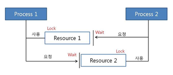

## 1. 정의

- 데드락은 교착 상태라는 뜻을 가지고 있다. 교착 상태란, 둘 이상의 프로세스가 다른 프로세스가 점유하고 있는 자원을 서로 기다릴 떄 무한 대기에 빠지는 상황이다.

### 예시

1. 프로세스 1은 자원 1을 사용하고 있고, 자원 2를 요청한다.
2. 프로세스 2는 자원 2를 사용하고 있고, 자원 1을 요청한다.

<aside>
💡 이때, 서로 원하는 자원이 상대방에 할당되어 있어서 두 프로세스가 무한정 Wait 상태에 빠지는 것을 DeadLock이라고 한다.

</aside>

## 2. 발생하는 환경

주로, 멀티 프로그래밍 환경에서 한정된 자원을 얻기 위해 서로 경쟁하는 상황이 발생하게 되는데 이때 DeadLock이 발생하는 경우가 있다.

## 3. DeadLock 발생 조건

DeadLock은 아래의 4가지 조건이 모두 성립해야 DeadLock이 발생한다. 하나라도 성립하지 않을 시 데드락 문제를 해결할 수 있다.

1. 상호 배제
    1. 자원은 한번에 한 프로세스만 사용할 수 있다. 사용중인 자원을 다른 프로세스가 사용하려면 요청한 자원이 해제될 때까지 기다려야 한다.
2. 점유 대기
    1. 자원을 최소한 하나 보유하고, 다른 프로세스에 할당된 자원을 점유하기 위해 대기하는 프로세스가 존재해야 한다.
3. 비선점
    1. 이미 할당된 자원을 강제로 빼앗을 수 없다.
4. 순환 대기
    1. 대기 프로세스의 집합이 순환 형태로 자원을 대기하고 있어야 한다.

## 4. DeadLock의 해결법

1. 발생하지 않도록 예방(prevention)하기
2. 발생 가능성을 인정하면서 적절하게 회피(avoidance)하기
3. DeadLock 발생을 허용하지만 DeadLock을 탐지(detection)하여, DeadLock에서 회복하기

### 4-1. 데드락 예방하기

데드락 발생 조건 4가지 중에서 하나라도 발생하기 않게 하는 것을 의미한다. (각각의 조건을 방지(부정)하여 데드락 발생 가능성을 차단한다.)

1. 자원의 상호 배제 조건 방지
2. 점유 대기 조건 방지
3. 비선점 조건 방지
4. 순환 대기 조건 방지

<aside>
💡 다만, 예방 하는 방법은 시스템의 처리량이나 효율성이 떨어지는 것이 단점

</aside>

### 4-2. 데드락 회피

데드락 회피법에서는 Safe sequence, Safe state 등이 키워드이다.

시스템의 프로세스들이 요청하는 모든 자원을, 데드락을 발생시키지 않으면서도 차례로 모두에게 할당해 줄 수 있다면 **안정 상태**(safe state)에 있다고 말한다.
그리고 이처럼 특정한 순서로 프로세스들에게 자원을 할당, 실행 및 종료 등의 작업을 할 때**데드락이 발생하지 않는 순서를 찾을 수 있다면**, 그것을**안전 순서**(safe sequence)라고 부른다.
반면 **불안정 상태**는 안정 상태가 아닌 상황을 말하며, **데드락 발생 가능성이 있는 상황**이다. **교착 상태(데드락)는 불안정 상태일 때 발생**할 수 있다. 불안정 상태가 교착 상태보다 좀 더 큰
집합이다.(
즉, 교착 상태가 불안정 상태의 부분집합)
이처럼 회피 알고리즘은 **자원을 할당한 후에도 시스템이 항상 Safe state에 있을 수 있도록 할당을 허용**하자는 것이 기본 특징이다.
이러한 특징을 살린 알고리즘으로 유명한 것이`은행원 알고리즘`입니다.

<aside>
💡 은행원 알고리즘이란?

다익스트라가 제안한 기법으로, 어떤 자원의 할당을 허용하는지에 관한 여부를 결정하기 전에, 미리 결정된 모든 자원들의 최대 가능한 할당량을 가지고 시뮬레이션 해서 Safe state에 들 수 있는지 여부를 검사하는
것이다. *즉, 대기 중 다른 프로세스들의 활동에 대한 교착 상태 가능성을 미리 조사하는 것이다.*

</aside>

### 4-3,4. 데드락 탐지 및 회복

데드락 예방이나 회피법을 사용하지 않았을 때, 데드락이 발생할 수 있으니 여기에서 회복하기 위해 데드락을 탐지하고, 회복하는 알고리즘을 사용한다.

1. 탐지 기법
    1. 은행원 알고리즘에서 했던 방식과 유사하게 현재 시스템의 자원 할당 상태를 가지고 파악한다.
    2. 자원 할당 그래프를 통해 탐지하는 방법도 있다.
2. 회복 기법

   `순환 대기`에서 벗어나 데드락으로부터 회복하기 위한 방법을 사용한다.

    1. 프로세스 종료 방법
        1. 교착 상태의 프로세스를 모두 중지
        2. 교착 상태가 제거될 때까지 하나씩 프로세스 중지
    2. 자원 선점 방법
        1. 교착 상태의 프로세스가 점유하고 있는 자원을 선점해 다른 프로세스에게 할당(해당 프로세스 일시 정지시킴)
        2. 우선 순위가 낮은 프로세스나 수행 횟수 적은 프로세스 위주로 프로세스 자원 선점