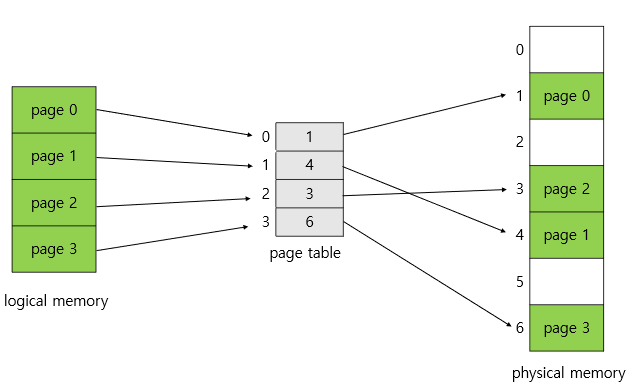
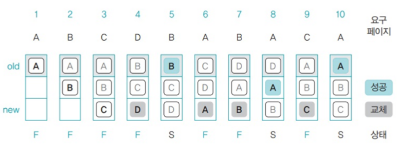
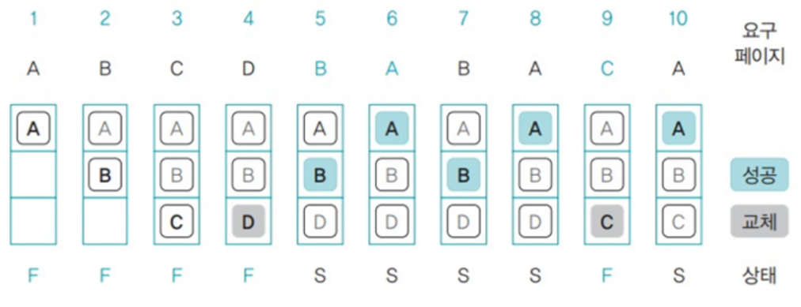
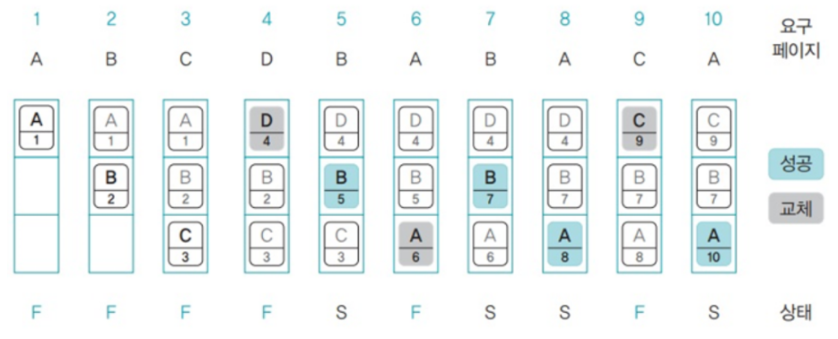
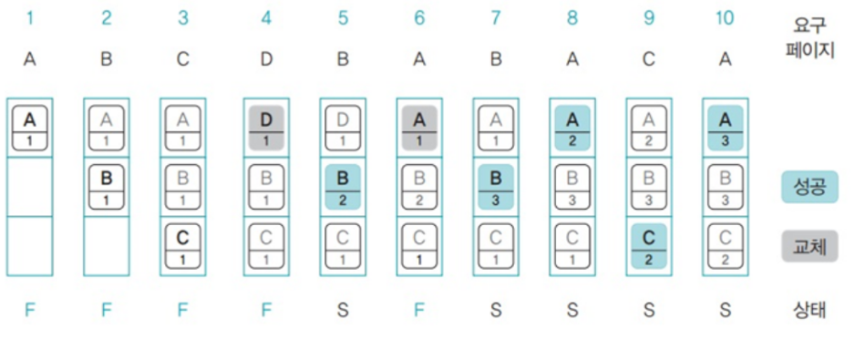

## 1. 페이징?

페이지 교체 알고리즘에 대해서 들어가기 전에 먼저 페이징이라는 개념에 대해서 확인해야 한다.
운영체제는 주기억장치보다 더 큰 용량의 프로그램을 실행하기 위해 프로그램의 일부만 주기억장치에 적재하여 사용한다. 이를 가상메모리 기법이라 한다.
페이징 기법으로 메모리를 관리하는 운영체제에서 필요한 페이지가 주기억장치에 적재되지 않았을 시(*`페이지 부재`*) 어떤 페이지 프레임을 선택하여 교체할 것인지 결정하는 방법을 **페이지 교체 알고리즘**이라고
한다.

<aside>
💡 프레임 : 물리 메모리를 일정한 크기로 나눈 블록
페이지 : 가상 메모리를 일정한 크기로 나눈 블록
</aside>

페이징 기법의 예시

## 2. 페이지 교체 알고리즘

### 🐮FIFO 페이지 교체 알고리즘

말그대로 선입선출 페이지 알고리즘으로 큐로 구현한다. 맨위에 있는 페이지는 가장 오래된 페이지이고 새로운 페이지는 맨 아래에 삽입된다.

- 맨 위에 있는 페이지에 자주 사용되는 페이지가 있을 수 있다.
- 무조건 오래된 페이지가 교체 대상이 되어 성능이 떨어질 수 있다.

### 🐼(최적)OPT 페이지 교체 알고리즘

최적 페이지 교체 알고리즘은**앞으로 사용하지 않을**페이지를 스왑 영역으로 옮긴다.

**미래의 메모리 접근 패턴을 보고 대상 페이지를 결정**하여 성능이 좋지만 미래의 접근 패턴을 안다는 것이 불가능하여 실제로 구현할 수 없다.

아래 4번을 보면 D를 넣기 위해 앞으로 사용할 페이지에 A, B, C가 있는지 본다. 페이지 C가 9번으로 가장 늦게 사용되므로 스왑 영역으로 보낸다.

### 🐵****LRU 페이지 교체 알고리즘****

LRU 페이지 교체 알고리즘(LRU, Least Recently Used)은**'최근 최소 사용 페이지 교체 알고리즘'**이라고도 한다. 즉,**가장 오랫동안 사용되지 않은 페이지**를 스왑 영역으로 옮긴다.

- OPT 보다는 페이지 결함이 더 일어날 수 있지만, 실제로 사용할 수 있는 페이지 교체 알고리즘에서는 가장 좋은 방법 중 하나다.

### 🦘**LFU 페이지 교체 알고리즘 (여기부터는 참고하기)**

LFU 페이지 교체 알고리즘(LFU, Least Frequently Used)은**'최소 빈도 사용 알고리즘'**이라고도 한다.

**페이지가 몇 번 사용되었는지를 기준**으로 대상 페이지를 선정한다.

FIFO 페이지 교체 알고리즘보다 성능은 우수하지만, 페이지 접근 횟수(빈도)를 표시하는 데 추가 공간이 필요하므로 그만큼 메모리가 낭비된다.

### 🦒****NUR 페이지 교체 알고리즘****

NUR 페이지 교체 알고리즘(NUR, Not Used Recently)은 LRU, LFU 페이지 교체 알고리즘과 성능이 비슷하면서도 불필요한 공간 낭비 문제를 해결한 알고리즘이다. 이 알고리즘은**추가 비트 2개만
사용하여 미래를 추정**한다.

**참조 비트**는 PTE의 접근 비트를 가리키고(접근하면 1), **변경 비트**는 PTE의 변경 비트를 가리킨다(변경되면 1).

가장 먼저**(0, 0)인 페이지를 선정하고 없다면 (0, 1) -> (1, 0) -> (1, 1) 순서로 선정**된다. 만약 모든 페이지가 (1, 1)이 되면 모든 페이지 비트를 (0, 0)으로 초기화한다.

