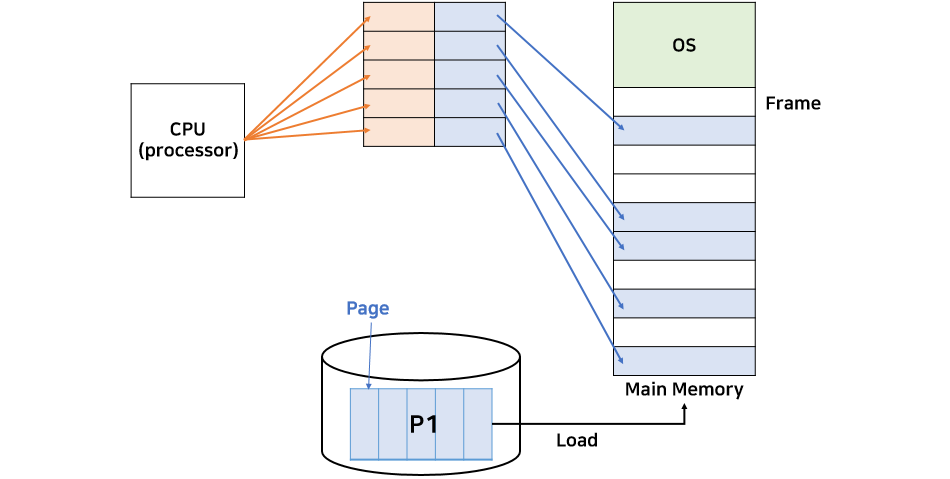
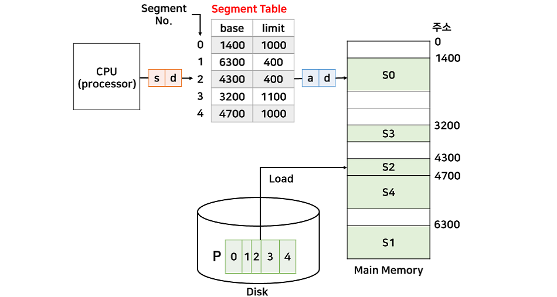

# 페이징과 세그먼테이션

### ⭐사전 지식
#### 메모리 단편화
- 어떠한 프로그램을 실행할 때, 컴퓨터에서는 프로그램들을 메모리 공간에 연속적으로 할당하게 됨
- 이때, 여러 프로그램들이 메모리에 할당/해제되는 것이 반복되다 보면 메모리 공간이 조각조각 나뉘게 되어 총 메모리가 충분함에도 불구하고 프로그램에 메모리를 할당하는 것이 불가능한 상태가 발생하게 됨
- 이러한 현상을 **메모리 단편화**라고 함

#### 메모리 관리 기법
- 연속 메모리 기법
  - 프로그램 전체가 메모리에 연속적으로 할당
  - 고정 분할 기법 : 메모리가 고정된 파티션으로 분할. **내부 단편화 발생**
  - 동적 분할 기법 : 파티션들이 동적으로 생성되고 자신의 크기와 같은 파티션에 메모리 할당. **외부 단편화 발생**
- 불연속 메모리 기법
  - 프로그램의 일부가 서로 다른 주소 공간에 할당될 수 있는 기법
  - Page : **프로세스**를 **고정된 크기**로 나눈 블록
  - Frame : **메모리**를 **고정된 크기**로 나는 블록
  - Segment : **서로 다른 크기**의 논리적 블록

### ⭐페이징(Paging)

- 프로세스는 페이지로 나뉘고, 물리 메모리는 프레임으로 나뉨
- 페이지 테이블에는 각 페이지 번호와 해당 페이지가 할당된 프레임의 시작 물리 주소를 저장
- CPU는 논리 주소로 프로그램이 설정한대로 연속적인 주소값으로 명령을 내리고 이는 메모리로 가기전에 각 페이지의 실제 메모리 주소가 저장되어 있는 테이블에서 물리 주소로 변경
- 프로세스의 크기가 페이지 크기의 배수가 아닐 경우 마지막 페이지에 내부 단편화가 발생하고 페이지의 크기가 클수록 내부 단편화가 커짐
  - 페이지 단위를 작게 하면 내부 단편화 문제도 해결할 수 있겠지만 page mapping 과정이 많아지므로 효율이 떨어짐

### ⭐세그먼테이션(Segmentation)

- 프로세스를 서로 크기가 다른 논리적인 블록 단위인 세그먼트(Segment)로 분할하여 메모리에 할당
- 각 세그먼트는 연속적인 공간에 저장
- 세그먼트들의 크기가 서로 다르기 때문에 프로세스가 메모리에 적재될 때 빈 공간을 찾아 할당하는 기법
- 프로세스가 필요한 메모리 공간만큼 메모리를 할당해주기 때문에 내부 단편화 문제는 발생하지 않지만, 중간에 메모리를 해제하면 생기는 외부 단편화 문제가 발생

### ⭐페이징 VS 세그먼테이션
- Paging은 고정 크기를 가짐
- Segmentation은 가변 크기를 가짐
- Paging은 내부 단편화 발생 가능, Segmentation은 외부 단편화 발생 가능
