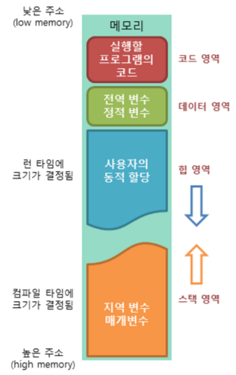

# Process

### process란?
- 실행파일(program)이 memory에 적재되어 CPU를 할당받아 실행되는 것을 process라고 함
- program이 CPU에서 실행되려면 memory에 적재된 상태여야함

### process의 주소 공간
- process에 할당되는 memory 공간은 Code, Data, Stack, Heap 4개의 영역으로 이루어짐
  
  1. Code Segment: 프로그램 소스 코드 저장
  2. Data Segment: 전역 변수 저장
  3. Stack Segment: 함수, 지역 변수 저장
  4. Heap : 동적할당
 
### 주소 공간을 나누는 이유?
데이터를 공유하여 메모리 사용량을 줄이기 위함

